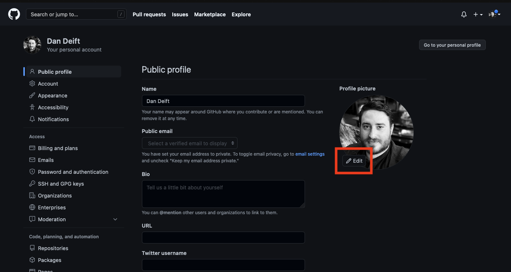
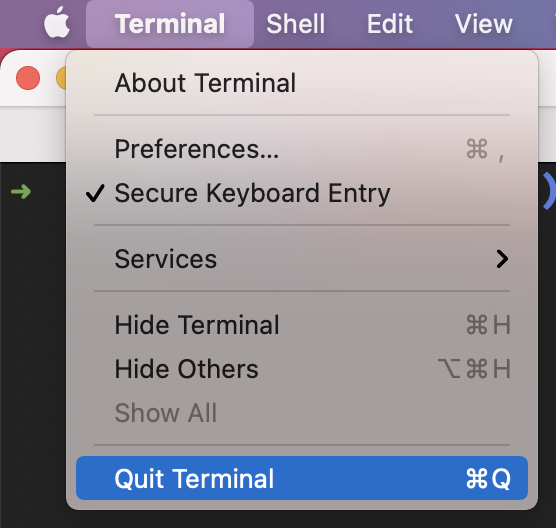
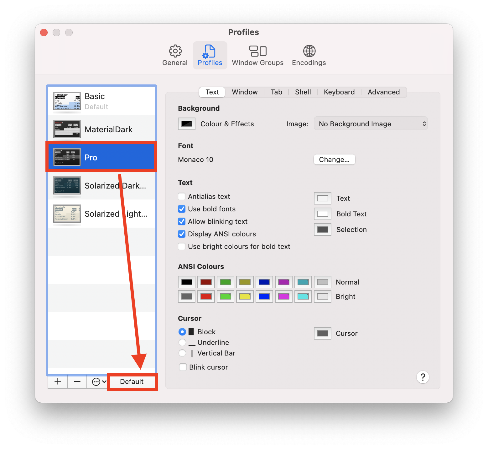
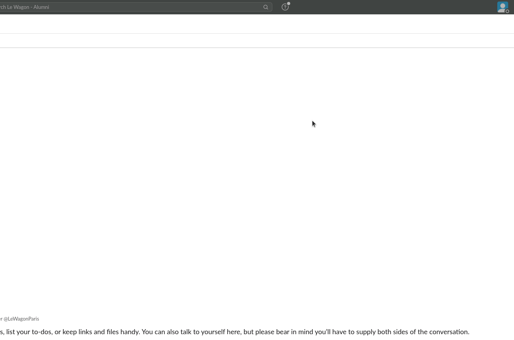
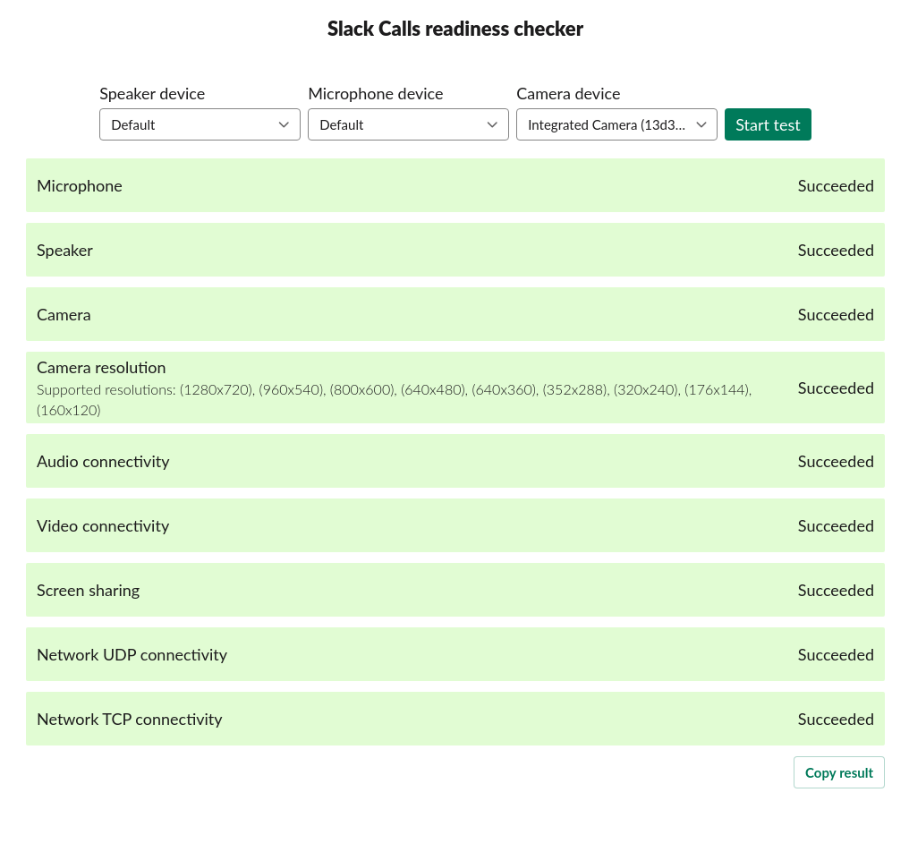
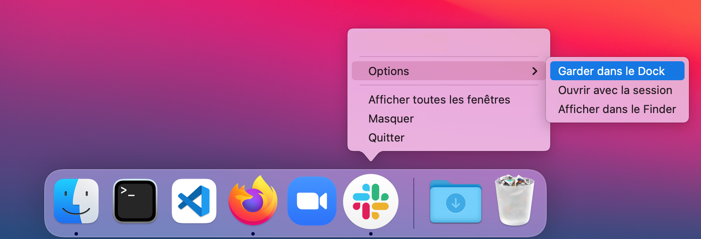

# Setup instructions

You will find below the instructions to set up you computer for [Le Wagon Web Development course](https://www.lewagon.com/web-development-course/full-time).

Please **read them carefully and execute all commands in the following order**. If you get stuck, don't hesitate to ask a teacher for help :raising_hand:

Let's start :rocket:


## Zoom

To be able to interact when we are not in the same physical room, we will be using [Zoom](https://zoom.us/), a video conferencing tool.

:warning: If you already have Zoom installed, please make sure that the version is at least **5.6**.

Go to [zoom.us/download](https://zoom.us/download).

Under **Zoom Client** click the **Download** button.

Open the file you have just downloaded to install the app.

Open the Zoom app.

If you have a Mac with Apple silicon, [you are asked to install Rosetta](https://support.apple.com/en-us/HT211861). Click Install, then enter your user name and password to allow installation to proceed.


If you already have a Zoom account, sign in using your credentials.

If not, click on the **Sign Up Free** link:


You will be redirected to Zoom's website to complete a form.

When it's done, go back to the Zoom app and sign in using your credentials.

You should then see a screen like this:


You can now close the Zoom app.


## GitHub account

Have you signed up to GitHub? If not, [do it right away](https://github.com/join).

:point_right: **[Upload a picture](https://github.com/settings/profile)** and put your name correctly on your GitHub account. This is important as we'll use an internal dashboard with your avatar. Please do this **now**, before you continue with this guide.




## A note about quitting apps on a Mac

Clicking the little red cross in the top left corner of the application window on a Mac **does not really quit it**, it just closes an active window. To quit the application _for real_ either press `Cmd + Q` when the application is active, or navigate to `APP_NAME` -> `Quit` in the menu bar.



During this setup you will be asked to **quit and re-open** applications multiple times, please make sure you do it properly :pray:

## Command Line Tools

Open a new terminal, copy-paste the following command and hit `ENTER`:

```bash
xcode-select --install
```

If you receive the following message, you can just skip this step and go to next step.

```bash
# command line tools are already installed, use "Software Update" to install updates
```

Otherwise, it will open a window asking you if you want to install some software: click on "Install" and wait.


:heavy_check_mark: If you see the message "The software was installed" then all good :+1:

:x: If the command `xcode-select --install` fails try again: sometimes the Apple servers are overloaded.

:x: If you see the message "Xcode is not currently available from the Software Update server", you need to update the software update catalog:

```bash
sudo softwareupdate --clear-catalog
```

Once this is done, you can try to install again.


## Homebrew

[Homebrew](http://brew.sh/) is a package manager: it's a software used to install other software from the command line. Let's install it!

Open a terminal and run:

```bash
/bin/bash -c "$(curl -fsSL https://raw.githubusercontent.com/Homebrew/install/HEAD/install.sh)"
```

This will ask for your confirmation (hit `ENTER`) and your **macOS user account password** (the one you use to [log in](https://support.apple.com/en-gb/HT202860) when you reboot your Macbook).

:warning: When you type your password, nothing will show up on the screen, **that's normal**. This is a security feature to mask not only your password as a whole but also its length. Just type your password and when you're done, press `ENTER`.

If you already have Homebrew, it will tell you so, that's fine, go on.

Then install some useful software:

```bash
brew update
```

If you get a `/usr/local must be writable` error, just run this:

```bash
sudo chown -R $USER:admin /usr/local
brew update
```

Error message or not, proceed running the following in the terminal (you can copy / paste all the lines at once).

```bash
brew upgrade git || brew install git
brew upgrade gh || brew install gh
brew upgrade wget || brew install wget
brew upgrade imagemagick || brew install imagemagick
brew upgrade jq || brew install jq
brew upgrade openssl || brew install openssl
```


## Visual Studio Code

### Installation

Let's install [Visual Studio Code](https://code.visualstudio.com) text editor.

Copy (`Cmd` + `C`) the command below then paste it in your terminal (`Cmd` + `V`):

```bash
brew install --cask visual-studio-code
```

Then launch VS Code by running the following command in your terminal:

```bash
code
```

:heavy_check_mark: If a VS Code window has just opened, you're good to go :+1:

:x: Otherwise, please **contact a teacher**


## VS Code Extensions

### Installation

Let's install some useful extensions to VS Code.

Copy-paste the following commands in your terminal:

```bash
code --install-extension formulahendry.auto-rename-tag
code --install-extension Yummygum.city-lights-icon-vsc
code --install-extension pranaygp.vscode-css-peek
code --install-extension donjayamanne.git-extension-pack
code --install-extension mhutchie.git-graph
code --install-extension donjayamanne.githistory
code --install-extension eamodio.gitlens
code --install-extension kisstkondoros.vscode-gutter-preview
code --install-extension xabikos.JavaScriptSnippets
code --install-extension ritwickdey.LiveServer
code --install-extension ms-vsliveshare.vsliveshare
code --install-extension PulkitGangwar.nextjs-snippets
code --install-extension Shan.code-settings-sync
code --install-extension wayou.vscode-todo-highlight

```

Here is a list of the extensions you are installing:
- [Auto Rename Tag](https://marketplace.visualstudio.com/items?formulahendry.auto-rename-tag)
- [City Lights Icon Package](https://marketplace.visualstudio.com/items?itemName=Yummygum.city-lights-icon-vsc)
- [CSS Peek](https://marketplace.visualstudio.com/items?itemName=pranaygp.vscode-css-peek)
- [Git Extention Pack](https://marketplace.visualstudio.com/items?itemName=donjayamanne.git-extension-pack)
- [Git graph](https://marketplace.visualstudio.com/items?itemName=mhutchie.git-graph)
- [Git History](https://marketplace.visualstudio.com/items?itemName=donjayamanne.githistory)
- [GitLens](https://marketplace.visualstudio.com/items?itemName=eamodio.gitlens)
- [Image Preview](https://marketplace.visualstudio.com/items?itemName=kisstkondoros.vscode-gutter-preview)
- [JavaScript ES6 Snippets](https://marketplace.visualstudio.com/items?itemName=xabikos.JavaScriptSnippets)
- [Live Server](https://marketplace.visualstudio.com/items?itemName=ritwickdey.LiveServer)
- [Live Share](https://marketplace.visualstudio.com/items?itemName=ms-vsliveshare.vsliveshare)
- [Next.js Snippets](https://marketplace.visualstudio.com/items?itemName=PulkitGangwar.nextjs-snippets)
- [Settings Sync](https://marketplace.visualstudio.com/items?itemName=Shan.code-settings-sync)
- [ToDo Highlighter](https://marketplace.visualstudio.com/items?itemName=wayou.vscode-todo-highlight)


### Live Share configuration

[Visual Studio Live Share](https://visualstudio.microsoft.com/services/live-share/) is a VS Code extension which allows you to share the code in your text editor for debugging and pair-programming: let's set it up!

Launch VS Code from your terminal by typing `code` and pressing `ENTER`.

Click on the little arrow at the bottom of the left bar :point_down:


- Click on the "Share" button, then on "GitHub (Sign in using GitHub account)".
- A popup appears asking you to sign in with GitHub: click on "Allow".
- You are redirected to a GitHub page in you browser asking you to authorize Visual Studio Code: click on "Continue" then "Authorize github".
- VS Code may display additional pop-ups: close them by clicking "OK".

That's it, you're good to go!


## macOS Terminal Theme

Launch a terminal, click on `Terminal > Preferences` and set the "Pro" theme as default profile.



**Quit and restart** your terminal: it should now have a nice black background, easier on the eyes.


## Oh-my-zsh

Let's install the `zsh` plugin [Oh My Zsh](https://ohmyz.sh/).

In a terminal execute the following command:

```bash
sh -c "$(curl -fsSL https://raw.github.com/ohmyzsh/ohmyzsh/master/tools/install.sh)"
```

If asked "Do you want to change your default shell to zsh?", press `Y`

At the end your terminal should look like this:


:heavy_check_mark: If it does, you can continue :+1:

:x: Otherwise, please **ask for a teacher**


## GitHub CLI

CLI is the acronym of [Command-line Interface](https://en.wikipedia.org/wiki/Command-line_interface).

In this section, we will use [GitHub CLI](https://cli.github.com/) to interact with GitHub directly from the terminal.

It should already be installed on your computer from the previous commands.

First in order to **login**, copy-paste the following command in your terminal:

:warning: **DO NOT edit the `email`**

```bash
gh auth login -s 'user:email' -w
```

You will get the following output:

```bash
! First copy your one-time code: 0EF9-D015
- Press Enter to open github.com in your browser...
```

Select and copy the code (`0EF9-D015` in the example), then press `ENTER`.

Your browser will open and ask you to authorize GitHub CLI to use your GitHub account. Accept and wait a bit.

Come back to the terminal, press `ENTER` again, and that's it.

To check that you are properly connected, type:

```bash
gh auth status
```

:heavy_check_mark: If you get `Logged in to github.com as <YOUR USERNAME> `, then all good :+1:

:x: If not, **contact a teacher**.

Then run the following configuration line:

```bash
gh config set git_protocol ssh
```


## SSH Key

### Generation

We need to generate SSH keys which are going to be used by GitHub to authenticate you. You can think of it as a way to log in, but different from the well known username/password pair.

:warning: If you already generated keys that you already use with other services, you can skip this step.

Open a terminal and copy-paste this command, replacing the email with **yours** (the same one you used to create your GitHub account).

```bash
mkdir -p ~/.ssh && ssh-keygen -t ed25519 -o -a 100 -f ~/.ssh/id_ed25519 -C "TYPE_YOUR_EMAIL@HERE.com"
```

It will prompt for information. Just press enter until it asks for a **passphrase**.

:warning: When asked for a passphrase, put something you want and that you'll remember. It's a password to protect your private key stored on your hard drive.

:warning: When you type your passphrase, nothing will show up on the screen, **that's normal**. This is a security feature to mask not only your passphrase as a whole but also its length. Just type your passphrase and when you're done, press `ENTER`.

### Giving your public key to GitHub

Now, you will give your **public** key to GitHub.

In your terminal copy-paste the following command:

```bash
gh auth refresh -s write:public_key
```

It will prompt a one time code (####-####) on the screen. Copy it and press `ENTER`, then paste the code in your browser and follow the instructions to **Authorize GitHub**.

Back in the terminal, press `ENTER` and run this:

```bash
gh ssh-key add ~/.ssh/id_ed25519.pub
```

This should return `✓ Public key added to your account`. If not, do not hesitate to **contact a teacher**.


## Node.js

[Node.js](https://nodejs.org/en/) is a JavaScript runtime to execute JavaScript code in the terminal. Let's install it with [nvm](https://github.com/nvm-sh/nvm), a version manager for Node.js.

In a terminal, execute the following commands:

```bash
curl -o- https://raw.githubusercontent.com/nvm-sh/nvm/v0.39.1/install.sh | zsh
exec zsh
```

Then run the following command:

```bash
nvm -v
```

You should see a version. If not, ask a teacher.

Now let's install node:

```bash
nvm install 16.13.1
```

When the installation is finished, run:

```bash
node -v
```

If you see `v16.13.1`, the installation succeeded :heavy_check_mark: You can then run:

```bash
nvm cache clear
```

:x: If not, **contact a teacher**


## yarn

[`yarn`](https://yarnpkg.com/) is a package manager to install JavaScript libraries. Let's install it:

In a terminal, run the following commands:

```bash
npm install --global yarn
exec zsh
```

Then run the following command:

```bash
yarn -v
```

:heavy_check_mark: If you see a version, you're good :+1:

:x: If not, **ask for a teacher**


## Check-up

Let's check if you successfully installed everything.

In you terminal, run the following command:

```bash
exec zsh
```

Then run:

```bash
curl -Ls https://raw.githubusercontent.com/lewagon/setup/master/check.rb > _.rb && ruby _.rb && rm _.rb || rm _.rb
```

:check_mark: If you get a green `Awesome! Your computer is now ready!`, then you're good :+1:

:x: If not, **contact a teacher**.


## Slack

[Slack](https://slack.com/) is a communcation platform pretty popular in the tech industry.

### Installation

[Download the Slack app](https://itunes.apple.com/fr/app/slack/id803453959?mt=12) and install it.

:warning: If you are already using Slack in your browser, please download and install **the desktop app** which is fully featured.


### Settings

Launch the app and sign in to `lewagon-alumni` organization.

Make sure you **upload a profile picture** :point_down:



The idea is that you'll have Slack open all day, so that you can share useful links / ask for help / decide where to go to lunch / etc.

To ensure that everything is working fine for video calls, let's test your camera and microphone:
- Open the Slack app
- In any channel message bar type `/call --test` and press `ENTER`
- Click on the "Start test" green button



:heavy_check_mark: When the test is finished, you should see green "Succeed" messages at least for your microphone and camera. :+1:

:x: If not, **contact a teacher**.

You can also install Slack app on your phone and sign in `lewagon-alumni`!


## macOS settings

### Security

It is mandatory that you protect your session behind a password.If it is not already the case, go to ` > System Preferences > Users & Groups` and change your account password. You should also go to ` > System Preferences > Security > General`. You should require a password `5 seconds` after sleep or screen saver begins.

You can also go to ` > System Preferences > Mission Control` and click on the `Hot Corners` button at the bottom left. Choose for the bottom right corner to start the screen saver. That way, when you leave your desk, you can quickly lock you screen by putting your mouse in the bottom right corner. 5 seconds after, your Macbook will be locked and will ask for a password to get back on the session.

### Keyboard

As you become a programmer, you'll understand that leaving the keyboard takes a lot of time, so you'll want to minimize using the trackpad or the mouse. Here are a few tricks on macOS to help you do that.

#### Keyboard speed

Go to ` > System Preferences > Keyboard`. Set `Key Repeat` to the fastest position (to the right) and `Delay Until Repeat` to the shortest position (to the right).

#### Full Keyboard Access

Go to ` > System Preferences > Keyboard`. Click on the third tab `Shortcuts`. At the bottom of the pane, click the radio button `All controls`. This way when you get a dialog with several options, you'll be able to type `ENTER` to confirm, or `SPACE` to choose the cancel option. If you have more than two options, you can use tab to circle between them.

#### macOS For hackers

[Read this script](https://github.com/mathiasbynens/dotfiles/blob/master/.macos) and cherry-pick some stuff you think will suit you. For instance, you can type in the terminal this one:

```bash
# Expanding the save panel by default
defaults write NSGlobalDomain NSNavPanelExpandedStateForSaveMode -bool true
defaults write NSGlobalDomain PMPrintingExpandedStateForPrint -bool true
defaults write NSGlobalDomain PMPrintingExpandedStateForPrint2 -bool true

# Save screenshots to the Desktop (or elsewhere)
defaults write com.apple.screencapture location "${HOME}/Desktop"

# etc..
```

### Pin apps to your dock

You are going to use most of the apps you've installed today really often. Let's pin them to your dock so that they are just one click away!

To pin an app to your dock, launch the app, right-click on the icon in the taskbar to bring up the context menu and choose "Options" then "Keep in Dock".



You must pin:
- Your terminal
- Your file explorer
- VS Code
- Your Internet browser
- Slack
- Zoom


## Setup completed!
